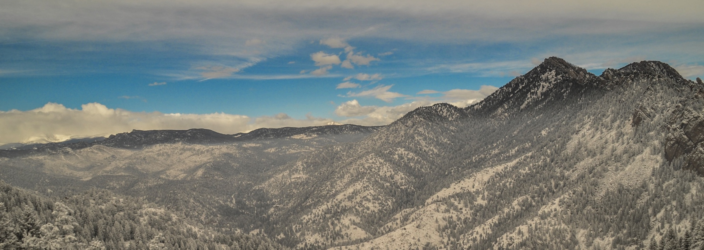

### About

My research has been broadly in the areas of data-driven geoscience and geoinformatics, with particular focus on the quantitative stratigraphy, paleoenvironment and paleoclimate. I am also interested in geospatial analytics, macroevolution, science history, and geoscience education.

As Turing Award winner, Jim Gray pointed out in his 2007 talk that data-driven research is becoming the fourth paradigm of scientific research. In the context of geoscience, large datasets widely exist in different sub-disciplines. Datasets of geoscience can be generated from laboratory, surveyed in the fields, simulated by computers, or of many other origins. Although these large datasets do exist, some long-standing hypotheses in geoscience are still data-limited, because syntheses of those large datasets were previously hard. With recent improvements of computing power and storage capabilities and newly developed quantitative analytical methods, geoscientists are now able to input large datasets for better evaluating hypotheses in order to obtain more robust understandings on the earth history and earth systems. As a geologist with hybrid background in computer science, I am interested in exploring ways of developing useful data infrastructure and workflows to extract, manipulate, and analyze large geoscince-related datasets, which can help us utilize the power of data-driven methods to discover hidden patterns in the earth history and answer more scientific questions.

I finished my Ph.D. in geoscience at University of Wisconsin-Madison, co-advised by [Shanan Peters](http://strata.geology.wisc.edu/) and [Shaun Marcott](https://geoscience.wisc.edu/people/marcott-shaun/). I hold a master's degree from the University of Tulsa supervised by [Bryan Tapp](https://faculty.utulsa.edu/faculty/bryan-tapp/) with a focus in geomechanics, and a B.S. degree in earth and environmental sciences from the University of Michigan. I also spent 2 years at the Pennsylvania State University where I received intensive training in GIS.
